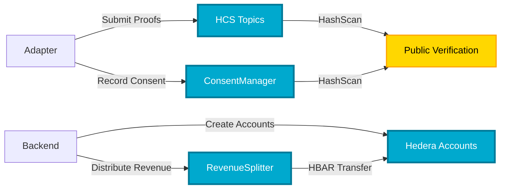
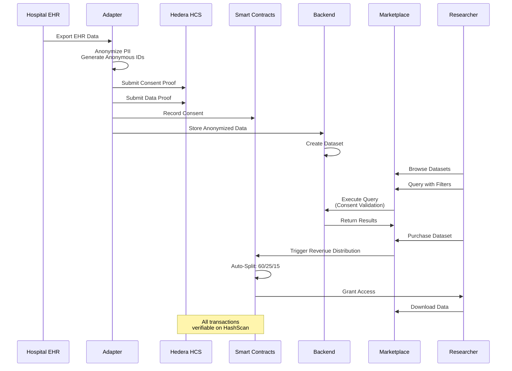
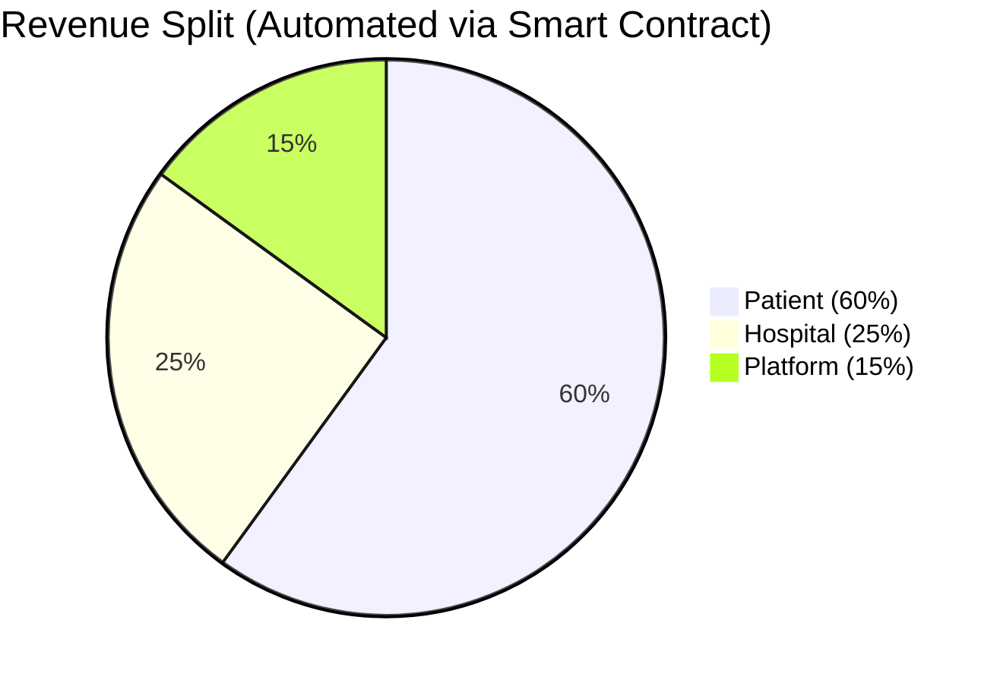
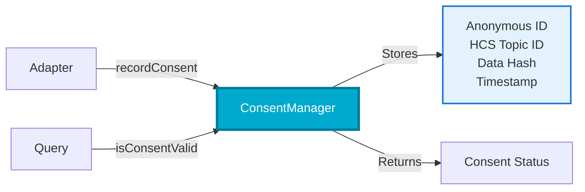
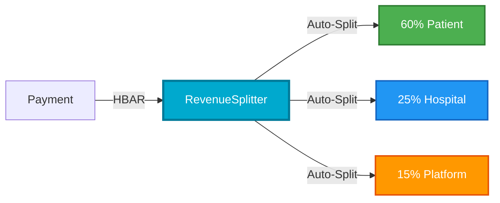
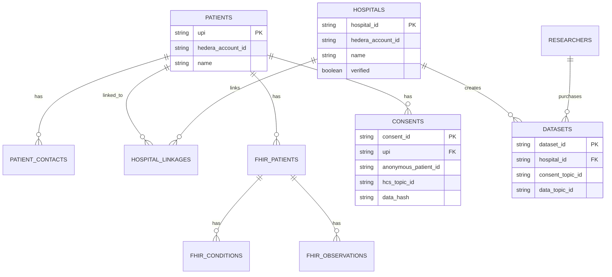
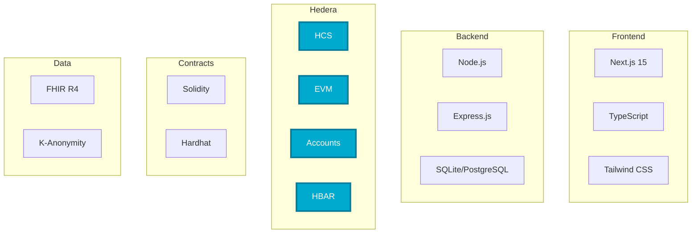

# MediPact - Verifiable Health Data Marketplace

> **Built on Hedera | Hackathon 2025**  
> **Track**: Open Track - Verifiable Healthcare Systems

<div align="center">

**Transform healthcare data into an ethical, transparent marketplace where patients are partners, not products.**

[](https://hedera.com)
[](LICENSE)
[](https://nodejs.org)

</div>

---

## 🎯 What It Is

**MediPact** is a verifiable medical data marketplace that empowers patients to control and monetize their anonymized medical data for research. Built on Hedera Hashgraph, we solve the multi-billion dollar patient data black market problem.

### The Problem: $30B+ Patient Data Black Market

1. **💔 Patients are Exploited**: Medical records sell for **$1,000/record** on dark web, yet patients see **$0 compensation**
2. **🔍 Researchers are Blind**: Cannot verify ethical sourcing or data authenticity
3. **🏥 Hospitals are Trapped**: 97% of data remains unused due to regulatory barriers

**Market**: $9.5B healthcare data tech market by 2033 (13% CAGR)

### Our Solution

- ✅ **Immutable Proof**: Consent & data hashes on Hedera Consensus Service (HCS)
- ✅ **Patient Control**: 60% revenue share from data sales
- ✅ **Secure Data Vault**: Encrypted storage with patient-controlled access
- ✅ **Automated Compensation**: 60/25/15 split via HBAR micropayments
- ✅ **Full Transparency**: All transactions verifiable on HashScan
- ✅ **Standards-Based**: FHIR R4 compliant

**Key Innovation**: **"In-Person Bridge"** - hospital-based onboarding for 3+ billion non-digital users

---

## 🌐 Hedera Integration

<div align="center">

### **Built on Four Pillars of Hedera**

[](https://hedera.com/consensus-service)
[](https://hedera.com/smart-contracts)
[](https://hedera.com)
[](https://hedera.com)

</div>

### Core Hedera Services

| Service | Usage | Impact |
|---------|-------|--------|
| **HCS** | Immutable storage of consent & data proof hashes | Unchangeable audit trail, ~$0.0001/message |
| **Hedera EVM** | ConsentManager & RevenueSplitter smart contracts | Automated consent registry & revenue distribution |
| **Hedera Account IDs** | Native accounts (0.0.xxxxx) for all users | Seamless UX, direct HBAR transfers |
| **HBAR** | Micropayments for 60/25/15 revenue split | Low-cost, instant settlements |

### Integration Flow



**Key Files**:
- `adapter/src/hedera/hcs-client.js` - HCS topic creation & message submission
- `adapter/src/hedera/evm-client.js` - Smart contract interactions
- `backend/src/services/hedera-account-service.js` - Account creation
- `backend/src/services/revenue-distribution-service.js` - HBAR distribution
- `contracts/contracts/ConsentManager.sol` - On-chain consent registry
- `contracts/contracts/RevenueSplitter.sol` - Automated revenue split

### Why Hedera?

✅ **HCS is unique** - No other blockchain offers immutable message logging  
✅ **Low fees** - Enables micropayments at scale (~$0.0001 per HCS message)  
✅ **High throughput** - 10,000+ TPS for thousands of daily queries  
✅ **Carbon negative** - Environmentally sustainable  
✅ **Native accounts** - Seamless UX without complex wallet management  
✅ **EVM compatible** - Smart contracts with low gas costs

### Network Impact (Projected)

- **100 hospitals** = 100,000+ Hedera accounts
- **1M patients** = 1M+ Hedera accounts  
- **10,000 daily queries** = 10,000+ daily HCS transactions
- **Revenue distributions** = Thousands of HBAR transfers daily

---

## 🏗️ System Architecture

```mermaid
graph TB
    subgraph "Frontend Layer"
        FE[Next.js 15 Frontend<br/>Patient | Hospital | Researcher | Admin]
    end
    
    subgraph "Backend Layer"
        API[Express.js REST API<br/>Routes | Services | Database]
    end
    
    subgraph "Processing Layer"
        ADAPTER[Adapter<br/>Anonymization | HCS Client | FHIR]
    end
    
    subgraph "Hedera Network"
        HCS[HCS Topics<br/>Consent & Data Proofs]
        EVM[EVM Contracts<br/>ConsentManager<br/>RevenueSplitter]
        ACCOUNTS[Hedera Accounts<br/>0.0.xxxxx]
        HBAR[HBAR<br/>Micropayments]
    end
    
    FE <-->|REST API| API
    API <-->|Data Processing| ADAPTER
    ADAPTER -->|HCS Messages| HCS
    ADAPTER -->|Contract Calls| EVM
    API -->|Create Accounts| ACCOUNTS
    API -->|Distribute Revenue| HBAR
    HBAR -->|Transfer| ACCOUNTS
    
    style FE fill:#E3F2FD,stroke:#1976D2,stroke-width:2px
    style API fill:#FFF3E0,stroke:#F57C00,stroke-width:2px
    style ADAPTER fill:#FCE4EC,stroke:#C2185B,stroke-width:2px
    style HCS fill:#00A9CE,color:#fff,stroke:#007A99,stroke-width:3px
    style EVM fill:#00A9CE,color:#fff,stroke:#007A99,stroke-width:3px
    style ACCOUNTS fill:#00A9CE,color:#fff,stroke:#007A99,stroke-width:3px
    style HBAR fill:#00A9CE,color:#fff,stroke:#007A99,stroke-width:3px
```

### Components

| Component | Technology | Purpose |
|-----------|-----------|---------|
| **Frontend** | Next.js 15, TypeScript, Tailwind CSS | Patient/Hospital/Researcher/Admin portals |
| **Backend** | Express.js, Node.js, SQLite/PostgreSQL | REST API, patient identity (UPI), marketplace |
| **Adapter** | Node.js, FHIR R4 | Processes EHR data, anonymizes PII, submits to HCS |
| **Smart Contracts** | Solidity (Hedera EVM) | ConsentManager & RevenueSplitter |

---

## 🔄 Data Flow



### Processing Pipeline


---

## 💰 Revenue Model



**How It Works**:
1. Researcher purchases dataset (pays in HBAR)
2. RevenueSplitter contract receives payment
3. **Automatically distributes**: 60% Patient, 25% Hospital, 15% Platform
4. All transactions verifiable on HashScan

**Benefits**: Trustless, Transparent, Instant, Low fees

---

## 🔐 Privacy & Anonymization

### Before vs. After

| Before (Raw) | After (Anonymized) |
|--------------|-------------------|
| ❌ Name: "John Doe" | ✅ Anonymous ID: "PID-001" |
| ❌ ID: "P-12345" | ✅ Removed |
| ❌ Address: "123 Main St" | ✅ Country Only: "Uganda" |
| ❌ Phone: "+256-123-4567" | ✅ Removed |
| ❌ DOB: "1990-01-15" | ✅ Age Range: "35-39" |
| ✅ Medical Data | ✅ Medical Data: Preserved |
| ✅ Demographics | ✅ Demographics: Preserved |

### K-Anonymity Protection

- **Minimum 5 records** per demographic group
- Groups: Country, Age Range, Gender, Occupation
- Records with <5 are **suppressed**

### Privacy Guarantees

- ✅ **No PII on Blockchain**: Only anonymous IDs and hashes
- ✅ **No Original Patient IDs**: ConsentManager stores only anonymous IDs
- ✅ **Demographics Generalized**: Prevents re-identification
- ✅ **K-Anonymity Enforced**: Privacy protection through grouping
- ✅ **Consent Validation**: Database-level enforcement

---

## ⚙️ Smart Contracts

### ConsentManager



**Functions**: `recordConsent()`, `revokeConsent()`, `isConsentValid()`, `getConsentByAnonymousId()`

### RevenueSplitter



**Functions**: `receive()` (auto-distribute), `distributeRevenueTo()`, `getSplitPercentages()`

---

## 🚀 Quick Start

### Prerequisites

- **Node.js 18+** - [Download](https://nodejs.org/)
- **Hedera Testnet Account** - [Get Free Account](https://portal.hedera.com/dashboard)
- **Git**

### Setup

```bash
# 1. Clone & install
git clone git@github.com:najuna-brian/medipact.git && cd medipact
cd adapter && npm install
cd ../backend && npm install  
cd ../frontend && npm install
cd ../contracts && npm install

# 2. Configure .env files (see Environment Variables section)

# 3. Start services
cd backend && npm start      # Port 3002
cd frontend && npm run dev   # Port 3000
cd adapter && npm start      # Process data
```

**Access**:
- 🌐 Frontend: http://localhost:3000
- 📚 API Docs: http://localhost:3002/api-docs
- ❤️ Health: http://localhost:3002/health

---

## 🔧 Environment Variables

### Adapter (`adapter/.env`)

```env
OPERATOR_ID="0.0.xxxxx"
OPERATOR_KEY="0x..."
HEDERA_NETWORK="testnet"
HOSPITAL_COUNTRY="Uganda"
HOSPITAL_ID="HOSP-XXXXXXXX"
BACKEND_API_URL="http://localhost:3002"
CONSENT_MANAGER_ADDRESS="0x..."      # Optional
REVENUE_SPLITTER_ADDRESS="0x..."     # Optional
```

### Backend (`backend/.env`)

```env
OPERATOR_ID="0.0.xxxxx"
OPERATOR_KEY="0x..."
HEDERA_NETWORK="testnet"
ENCRYPTION_KEY="your-32-byte-hex-key"  # openssl rand -hex 32
PORT=3002
DATABASE_PATH="./data/medipact.db"
JWT_SECRET="your-jwt-secret"
```

### Frontend (`frontend/.env.local`)

```env
NEXT_PUBLIC_API_URL="http://localhost:3002"
NEXT_PUBLIC_HEDERA_NETWORK="testnet"
```

---

## 📡 API Documentation

**Interactive Swagger UI**: http://localhost:3002/api-docs

### Key Endpoints

| Category | Endpoints |
|----------|-----------|
| **Patient** | `POST /api/patient/register`, `GET /api/patient/:upi/history` |
| **Hospital** | `POST /api/hospital/register`, `GET /api/hospital/:hospitalId` |
| **Researcher** | `POST /api/researcher/register`, `GET /api/researcher/:researcherId` |
| **Marketplace** | `GET /api/marketplace/datasets`, `POST /api/marketplace/query`, `POST /api/marketplace/purchase` |
| **Revenue** | `POST /api/revenue/distribute` |
| **Adapter** | `POST /api/adapter/submit-fhir-resources`, `POST /api/adapter/create-dataset` |

---

## 🗄️ Database Schema



---

## 🛠️ Technology Stack



| Layer | Technology |
|-------|-----------|
| **Frontend** | Next.js 15, TypeScript, Tailwind CSS |
| **Backend** | Node.js, Express.js, SQLite/PostgreSQL |
| **Hedera** | HCS, EVM, Accounts, HBAR |
| **Smart Contracts** | Solidity, Hardhat |
| **Data Standards** | FHIR R4, K-Anonymity |

---

## ✨ Key Features

- ✅ **FHIR R4 Compliant** - Interoperable with Medical Records Systems
- ✅ **K-Anonymity Enforcement** - Privacy by design (min 5 records per group)
- ✅ **HCS Immutable Proof Storage** - Unchangeable audit trail
- ✅ **Secure Data Vault** - Encrypted storage with patient-controlled access
- ✅ **Automated HBAR Revenue Distribution** - 60/25/15 split via smart contract
- ✅ **Patient Identity System (UPI)** - Cross-hospital linking
- ✅ **Consent Validation** - Database-level enforcement
- ✅ **Multi-Dimensional Query Engine** - Filter by country, date, condition, demographics
- ✅ **Smart Contract Integration** - On-chain consent registry and revenue distribution
- ✅ **Role-Based Dashboards** - Patient, Hospital, Researcher, Admin portals
- ✅ **HashScan Verification** - All transactions publicly verifiable

### Unique Differentiators

1. **Two-Path Onboarding**: Digital + in-person hospital process
2. **HCS + EVM Integration**: First healthcare marketplace combining immutable proof with automated payments
3. **Secure Data Vault**: Patient-controlled encrypted storage
4. **Ethical by Design**: True patient consent, privacy, and fairness
5. **Complete Solution**: Full data pipeline from extraction to marketplace

---

## 🧪 Development

```bash
# Run tests
cd contracts && npm test
cd adapter && npm run validate

# Development mode
cd backend && npm run dev
cd frontend && npm run dev

# Deploy contracts
cd contracts && npm run deploy:testnet
```

---

## 🐛 Troubleshooting

| Issue | Solution |
|-------|----------|
| **"OPERATOR_ID required"** | Create `.env` with Hedera credentials from [portal.hedera.com](https://portal.hedera.com/dashboard) |
| **"Transaction failed"** | Ensure account has HBAR balance (testnet faucet available) |
| **"Port in use"** | Change `PORT` in `backend/.env` |
| **"Failed to record consent on-chain"** | Check `CONSENT_MANAGER_ADDRESS` and ensure sufficient HBAR for gas |
| **"Failed to execute payout"** | Check `REVENUE_SPLITTER_ADDRESS` and HBAR balance |
| **"Database connection error"** | Ensure `data/` directory exists (SQLite) or check `DATABASE_URL` (PostgreSQL) |

---

## 📚 Resources

- [Adapter README](./adapter/README.md) - Data processing details
- [Backend README](./backend/README.md) - API documentation
- [Frontend README](./frontend/README.md) - Frontend architecture
- [Contracts README](./contracts/README.md) - Smart contract details
- [Pitch Deck](./PITCH_DECK.md) - Complete project overview

**External Links**:
- [Hedera Portal](https://portal.hedera.com/) - Get testnet account
- [HashScan Explorer](https://hashscan.io/) - View transactions
- [FHIR R4 Specification](https://www.hl7.org/fhir/) - Healthcare data standard

---

## 🤝 Contributing

See [CONTRIBUTING.md](./CONTRIBUTING.md) for development workflow and guidelines.

---

## 📄 License

[To be determined - Apache 2.0 or MIT]

---

## 🏆 Hackathon Information

**Hackathon**: Hedera Hello Future: Ascension 2025  
**Track**: Open Track - Verifiable Healthcare Systems  
**Team**: Team Medipact

---

<div align="center">

**Built on Hedera. Built for the Future.**

[GitHub](https://github.com/najuna-brian/medipact) • [Documentation](./docs) • [Issues](https://github.com/najuna-brian/medipact/issues)

</div>
