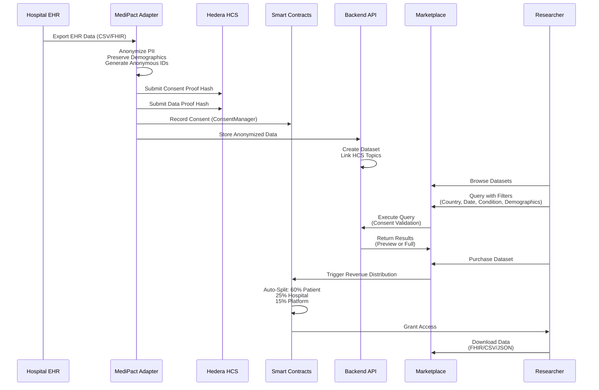
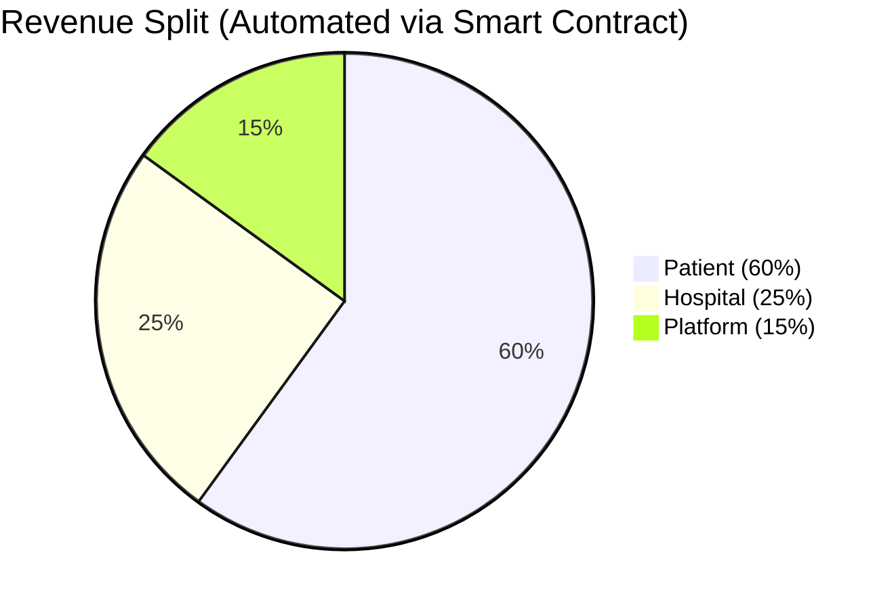
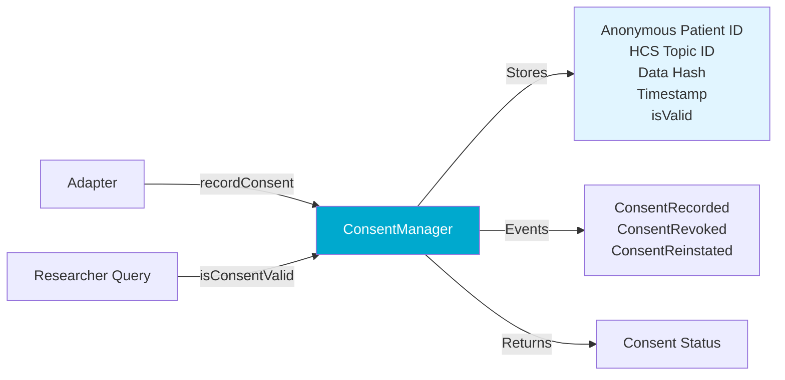
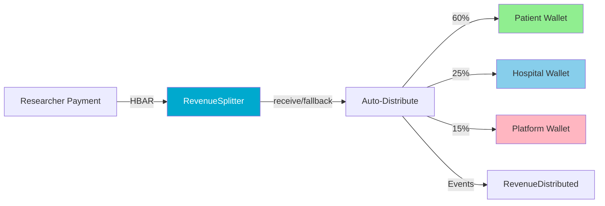
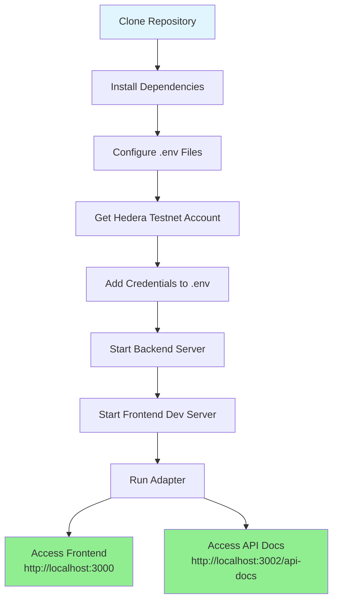
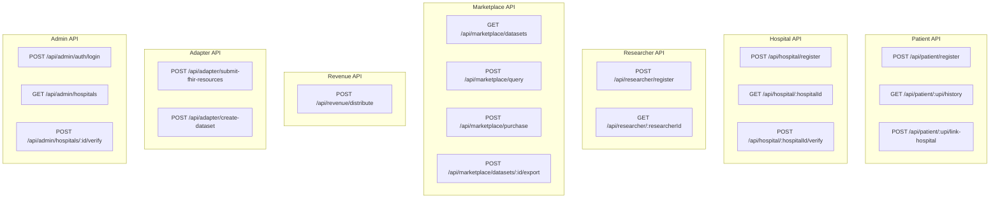
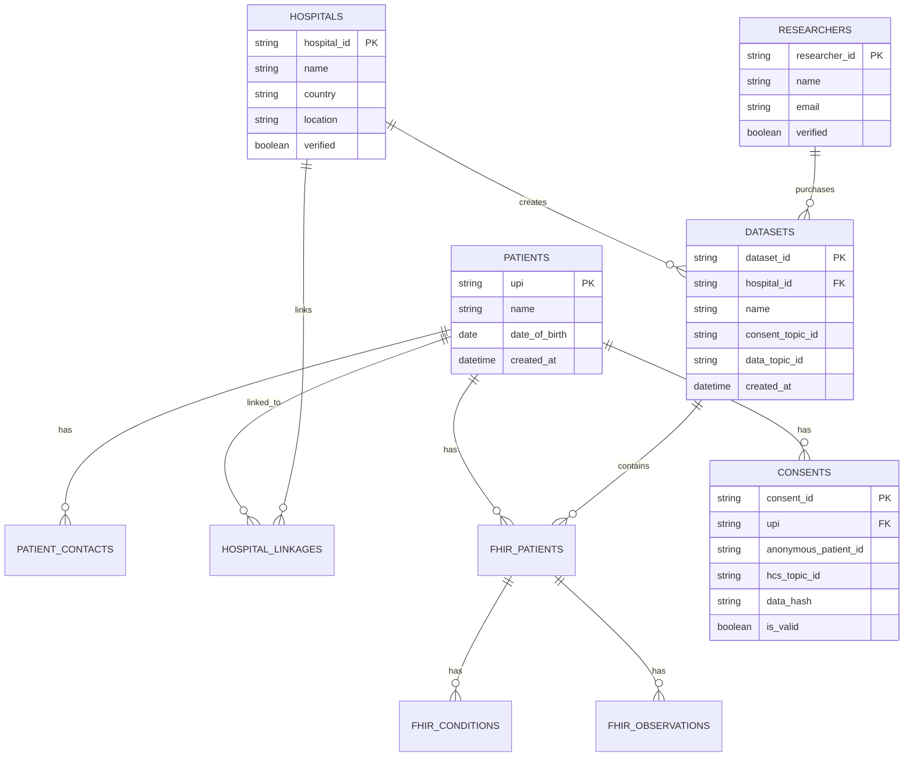
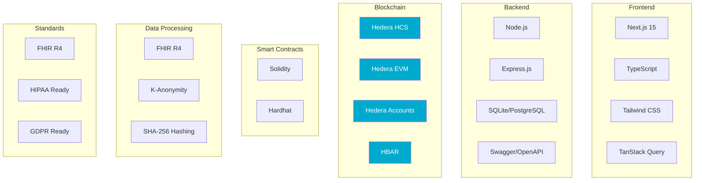

# MediPact - Verifiable Health Data Marketplace

> **Built on Hedera | Hackathon 2025**  
> **Track**: Open Track - Verifiable Healthcare Systems

<div align="center">

**Transform healthcare data into an ethical, transparent marketplace where patients are partners, not products.**

[](https://hedera.com)
[](LICENSE)
[](https://nodejs.org)

</div>

---

## 🎯 What It Is

**MediPact** is a verifiable medical data marketplace that empowers patients to control and monetize their anonymized medical data for research. Built on Hedera Hashgraph, we solve the multi-billion dollar patient data black market problem by creating a transparent, ethical platform using the Hedera Consensus Service for immutable proof and HBAR for instant micropayments.

### The Problem: $30B+ Patient Data Black Market

The current healthcare ecosystem faces three critical failures:

1. **💔 Patients are Exploited**: Medical records can sell for up to **$1,000 per record** on the dark web (more than credit card numbers), yet patients see **$0 compensation**. Data is sold without their knowledge, consent, or fair compensation.

2. **🔍 Researchers are Blind**: Inability to verify the ethical sourcing or authenticity of data creates a lack of trust and slows innovation in critical areas like AI diagnostics and personalized medicine.

3. **🏥 Hospitals are Trapped**: Legacy systems and complex, varied regulations make safe, legal data sharing nearly impossible, despite hospitals generating massive amounts of largely unused data (**up to 97% remains unused**).

**Market Opportunity**: The global healthcare data technology market is projected to reach **$9.5 billion by 2033**, growing at a CAGR of over **13%**. The broader digital health market is valued at over **$427 billion in 2025**.

### Our Solution

**MediPact** transforms this broken system into an ethical marketplace with:

- ✅ **Immutable Proof**: Patient consent and data authenticity hashes logged on Hedera Consensus Service (HCS) - unchangeable, auditable trail
- ✅ **Patient Control & Compensation**: Patients receive **60% revenue share** from data sales
- ✅ **Secure Data Vault**: Encrypted storage with granular access controls - patients control their complete medical history
- ✅ **Automated Fair Compensation**: **60% (Patient) / 25% (Hospital) / 15% (MediPact)** revenue split via HBAR micropayments
- ✅ **Full Transparency**: All transactions publicly verifiable on HashScan
- ✅ **Standards-Based**: FHIR R4 compliant for production-ready, real-world health solutions

**Key Innovation**: The **"In-Person Bridge"** - hospital-based onboarding designed for global scalability, reaching **3+ billion individuals** who may not have smartphones or apps.

---

## 🏗️ System Architecture

### High-Level Overview

```mermaid
graph TB
    subgraph "Frontend Layer"
        FE[Next.js 15 Frontend<br/>Patient | Hospital | Researcher | Admin Portals]
    end
    
    subgraph "Backend Layer"
        API[Express.js REST API<br/>Routes | Services | Database]
    end
    
    subgraph "Processing Layer"
        ADAPTER[Adapter<br/>Anonymization | HCS Client | FHIR Processing]
    end
    
    subgraph "Blockchain Layer"
        HEDERA[Hedera Network<br/>HCS Topics | EVM Contracts | Account IDs | HBAR]
    end
    
    FE <-->|REST API| API
    API <-->|Data Processing| ADAPTER
    ADAPTER <-->|Immutable Proofs| HEDERA
    API <-->|Smart Contracts| HEDERA
    
    style FE fill:#e1f5ff
    style API fill:#fff4e1
    style ADAPTER fill:#ffe1f5
    style HEDERA fill:#00A9CE,color:#fff
```

### Component Details

| Component | Technology | Purpose |
|-----------|-----------|---------|
| **Frontend** | Next.js 15, TypeScript, Tailwind CSS | Patient/Hospital/Researcher/Admin portals with health wallet |
| **Backend** | Express.js, Node.js, SQLite/PostgreSQL | REST API with patient identity (UPI), marketplace, secure data vault |
| **Adapter** | Node.js, FHIR R4 | Processes EHR data, anonymizes PII, submits proofs to HCS |
| **Smart Contracts** | Solidity (Hedera EVM) | ConsentManager & RevenueSplitter for on-chain logic |

---

## 🔄 Complete Data Flow

### End-to-End Journey



### Data Processing Pipeline

```mermaid
flowchart LR
    A[Raw EHR Data<br/>CSV/FHIR] --> B[Parse & Validate]
    B --> C[Anonymize PII]
    C --> D[Preserve Demographics<br/>Age Range, Country, Gender]
    D --> E[Generate Anonymous IDs<br/>PID-001, PID-002...]
    E --> F[Enforce K-Anonymity<br/>Min 5 records per group]
    F --> G[Generate Hashes<br/>Consent & Data Proofs]
    G --> H[Submit to HCS]
    H --> I[Record on Smart Contract]
    I --> J[Store in Backend]
    J --> K[Marketplace Ready]
    
    style A fill:#ffcccc
    style C fill:#ffffcc
    style D fill:#ccffcc
    style K fill:#ccccff
```



---

## 💰 Revenue Model

### Automated Revenue Distribution



**How It Works**:
1. Researcher purchases dataset (pays in HBAR)
2. RevenueSplitter smart contract receives payment
3. **Automatically distributes**:
   - **60%** → Patient wallet (HBAR)
   - **25%** → Hospital wallet (HBAR)
   - **15%** → Platform wallet (HBAR)
4. All transactions verifiable on HashScan

**Benefits**:
- ✅ Trustless (no manual intervention)
- ✅ Transparent (all on-chain)
- ✅ Instant (HBAR micropayments)
- ✅ Low fees (Hedera's cost-effective network)

---

## 🔐 Privacy & Anonymization

### Before vs. After Anonymization

| Before (Raw Data) | After (Anonymized) |
|-------------------|-------------------|
| ❌ Patient Name: "John Doe" | ✅ Anonymous ID: "PID-001" |
| ❌ Patient ID: "P-12345" | ✅ Removed |
| ❌ Address: "123 Main St" | ✅ Country Only: "Uganda" |
| ❌ Phone: "+256-123-4567" | ✅ Removed |
| ❌ Exact DOB: "1990-01-15" | ✅ Age Range: "35-39" |
| ✅ Medical Data: Lab results | ✅ Medical Data: Preserved |
| ✅ Demographics: Gender | ✅ Demographics: Preserved |

### K-Anonymity Protection

- **Minimum 5 records** per demographic group
- Groups defined by: Country, Age Range, Gender, Occupation Category
- Records in groups with <5 records are **suppressed** for privacy
- Ensures no individual can be re-identified

### Privacy Guarantees

- ✅ **No PII on Blockchain**: Only anonymous IDs (PID-XXX) and hashes stored
- ✅ **No Original Patient IDs**: ConsentManager contract stores only anonymous IDs
- ✅ **Demographics Generalized**: Age ranges and occupation categories prevent re-identification
- ✅ **K-Anonymity Enforced**: Privacy protection through demographic grouping
- ✅ **Consent Validation**: Database-level enforcement (cannot be bypassed)

---

## 📁 Project Structure

```
medipact/
├── adapter/                    # Data processing & HCS integration
│   ├── src/
│   │   ├── anonymizer/        # PII removal, demographic preservation
│   │   │   ├── anonymize.js
│   │   │   └── demographic-anonymize.js
│   │   ├── fhir/              # FHIR R4 processing
│   │   ├── hedera/            # HCS & EVM clients
│   │   │   ├── hcs-client.js
│   │   │   └── evm-client.js
│   │   ├── services/          # UPI integration, revenue distribution
│   │   └── utils/             # Hashing, validation, currency
│   ├── data/                  # Sample EHR data (CSV/FHIR)
│   ├── scripts/               # Validation, testing scripts
│   └── tests/                 # Unit & integration tests
│
├── backend/                   # Express.js REST API
│   ├── src/
│   │   ├── routes/            # API endpoints
│   │   │   ├── patient-api.js
│   │   │   ├── hospital-api.js
│   │   │   ├── researcher-api.js
│   │   │   ├── marketplace-api.js
│   │   │   ├── revenue-api.js
│   │   │   └── adapter-api.js
│   │   ├── services/         # Business logic
│   │   │   ├── patient-identity-service.js
│   │   │   ├── hospital-registry-service.js
│   │   │   └── revenue-distribution-service.js
│   │   ├── db/               # Database layer
│   │   │   ├── patient-db.js
│   │   │   ├── hospital-db.js
│   │   │   ├── fhir-db.js
│   │   │   └── consent-db.js
│   │   └── config/           # Swagger, database config
│   ├── data/                 # SQLite database (dev)
│   └── scripts/              # Setup, testing scripts
│
├── frontend/                 # Next.js 15 application
│   └── src/
│       ├── app/              # App router pages
│       │   ├── patient/      # Patient portal
│       │   ├── hospital/     # Hospital portal
│       │   ├── researcher/   # Researcher portal
│       │   └── admin/        # Admin dashboard
│       ├── components/       # React components
│       │   ├── AdapterDemo.tsx
│       │   ├── ConsentForm.tsx
│       │   └── HashScanLink.tsx
│       ├── hooks/            # Custom React hooks
│       ├── lib/              # API clients, utilities
│       └── types/            # TypeScript definitions
│
└── contracts/               # Solidity smart contracts
    ├── contracts/
    │   ├── ConsentManager.sol    # On-chain consent registry
    │   └── RevenueSplitter.sol   # Automated revenue distribution
    ├── scripts/
    │   └── deploy.js             # Deployment scripts
    └── test/                      # Contract tests
```

---

## ⚙️ Smart Contract Architecture

### ConsentManager Contract

Manages on-chain consent registry (NO PII stored - only anonymous IDs):



**Key Functions**:
- `recordConsent(anonymousPatientId, hcsTopicId, dataHash)` - Record new consent
- `revokeConsent(anonymousPatientId)` - Revoke consent
- `isConsentValid(anonymousPatientId)` - Check consent validity
- `getConsentByAnonymousId(anonymousPatientId)` - Get consent record

### RevenueSplitter Contract

Automated revenue distribution (60/25/15 split):



**Key Functions**:
- `receive()` - Auto-distributes when HBAR received
- `distributeRevenueTo(patientWallet, hospitalWallet)` - Manual distribution with dynamic addresses
- `getSplitPercentages()` - Returns 60/25/15 split
- `getBalance()` - Current contract balance

**Revenue Split Constants**:
- `PATIENT_SHARE = 6000` (60% in basis points)
- `HOSPITAL_SHARE = 2500` (25% in basis points)
- `MEDIPACT_SHARE = 1500` (15% in basis points)

---

## 🚀 Quick Start

### Prerequisites

- **Node.js 18+** - [Download](https://nodejs.org/)
- **Hedera Testnet Account** - [Get Free Account](https://portal.hedera.com/dashboard)
- **Git** - For cloning the repository

### Setup (5 minutes)

```bash
# 1. Clone repository
git clone git@github.com:najuna-brian/medipact.git
cd medipact

# 2. Install dependencies
cd adapter && npm install
cd ../backend && npm install  
cd ../frontend && npm install
cd ../contracts && npm install

# 3. Configure environment variables
# See Environment Variables section below

# 4. Start services
cd backend && npm start      # Port 3002
cd frontend && npm run dev   # Port 3000
cd adapter && npm start      # Process data
```

### Setup Flow Diagram



**Access Points**:
- 🌐 **Frontend**: http://localhost:3000
- 📚 **API Documentation**: http://localhost:3002/api-docs
- ❤️ **Health Check**: http://localhost:3002/health

---

## 🔧 Environment Variables

### Adapter (`adapter/.env`)

```env
# Hedera Configuration (Required)
OPERATOR_ID="0.0.xxxxx"              # Your Hedera account ID
OPERATOR_KEY="0x..."                 # Your private key (ECDSA, HEX)
HEDERA_NETWORK="testnet"             # testnet, mainnet, previewnet

# Hospital Configuration (Required)
HOSPITAL_COUNTRY="Uganda"            # Used for demographic fallback
HOSPITAL_LOCATION="Kampala, Uganda" # Optional
HOSPITAL_ID="HOSP-XXXXXXXX"          # For revenue distribution

# Backend Integration
BACKEND_API_URL="http://localhost:3002"

# Smart Contract Addresses (Optional)
CONSENT_MANAGER_ADDRESS="0x..."      # From contract deployment
REVENUE_SPLITTER_ADDRESS="0x..."     # From contract deployment
```

### Backend (`backend/.env`)

```env
# Hedera Configuration
OPERATOR_ID="0.0.xxxxx"
OPERATOR_KEY="0x..."
HEDERA_NETWORK="testnet"

# Server Configuration
PORT=3002
NODE_ENV=development

# Database
DATABASE_PATH="./data/medipact.db"   # SQLite for dev
# OR for production:
# DATABASE_URL="postgresql://..."    # PostgreSQL connection string

# Security
ENCRYPTION_KEY="your-32-byte-hex-key"  # Generate: openssl rand -hex 32
JWT_SECRET="your-jwt-secret"
JWT_EXPIRES_IN="24h"
```

### Frontend (`frontend/.env.local`)

```env
NEXT_PUBLIC_API_URL="http://localhost:3002"
NEXT_PUBLIC_HEDERA_NETWORK="testnet"
```

---

## 📡 API Documentation

### Interactive Swagger UI

Access comprehensive, interactive API documentation at:
**http://localhost:3002/api-docs**

### API Endpoint Map



### Key Endpoints

#### Patient Management
- `POST /api/patient/register` - Register new patient
- `POST /api/patient/lookup` - Lookup patient UPI by contact info
- `GET /api/patient/:upi/history` - Get complete medical history
- `POST /api/patient/:upi/link-hospital` - Link hospital to patient

#### Hospital Management
- `POST /api/hospital/register` - Register new hospital
- `GET /api/hospital/:hospitalId` - Get hospital information
- `POST /api/hospital/:hospitalId/verify` - Submit verification documents

#### Researcher Management
- `POST /api/researcher/register` - Register new researcher
- `GET /api/researcher/:researcherId` - Get researcher information

#### Marketplace
- `GET /api/marketplace/datasets` - Browse available datasets
- `POST /api/marketplace/query` - Execute query with filters (consent-validated)
- `POST /api/marketplace/purchase` - Purchase dataset
- `POST /api/marketplace/datasets/:id/export` - Export dataset (FHIR/CSV/JSON)

#### Revenue Distribution
- `POST /api/revenue/distribute` - Distribute revenue from sale
- `POST /api/revenue/distribute-bulk` - Distribute revenue for multiple sales

#### Health & Admin
- `GET /health` - Health check
- `GET /api-docs` - Interactive Swagger UI

---

## 🗄️ Database Schema (Simplified)

### Core Entities



### Key Tables

| Table | Purpose |
|-------|---------|
| `patients` | Patient identity with UPI (Unique Patient Identifier) |
| `patient_contacts` | Contact information (email, phone, national_id) for UPI lookup |
| `hospitals` | Hospital registry with verification status |
| `hospital_linkages` | Links patients to hospitals (many-to-many) |
| `researchers` | Researcher registry with verification |
| `consents` | Consent records linked to HCS topics |
| `datasets` | Marketplace datasets with metadata |
| `fhir_patients` | Anonymized FHIR patient resources |
| `fhir_conditions` | Medical conditions (linked to patients) |
| `fhir_observations` | Lab results, observations (linked to patients) |

---

## 🛠️ Technology Stack

### Complete Stack Visualization



### Technology Details

| Layer | Technology | Purpose |
|-------|-----------|---------|
| **Frontend** | Next.js 15, TypeScript, Tailwind CSS | Modern, type-safe React application |
| **Backend** | Node.js, Express.js | RESTful API with Swagger documentation |
| **Database** | SQLite (dev) / PostgreSQL (prod) | Patient identity, marketplace, secure vault |
| **Blockchain** | Hedera HCS, EVM, Accounts, HBAR | Immutable proofs, smart contracts, micropayments |
| **Smart Contracts** | Solidity, Hardhat | ConsentManager, RevenueSplitter |
| **Data Standards** | FHIR R4 | Healthcare interoperability |
| **Privacy** | K-Anonymity, SHA-256 | Patient privacy protection |

---

## ✨ Key Features

### ✅ Implemented Features

- ✅ **FHIR R4 Compliant** - Interoperable with most Medical Records Systems
- ✅ **K-Anonymity Enforcement** - Privacy by design (minimum 5 records per demographic group)
- ✅ **HCS Immutable Proof Storage** - Unchangeable audit trail on Hedera
- ✅ **Secure Data Vault** - Encrypted storage with patient-controlled access
- ✅ **Automated HBAR Revenue Distribution** - 60/25/15 split via smart contract
- ✅ **Patient Identity System (UPI)** - Unique Patient Identifier for cross-hospital linking
- ✅ **Consent Validation** - Database-level enforcement (cannot be bypassed)
- ✅ **Multi-Dimensional Query Engine** - Filter by country, date, condition, demographics
- ✅ **Smart Contract Integration** - On-chain consent registry and revenue distribution
- ✅ **Role-Based Dashboards** - Patient, Hospital, Researcher, Admin portals
- ✅ **Patient Health Wallet** - Complete medical history management
- ✅ **HashScan Verification** - All transactions publicly verifiable

### 🎯 Unique Differentiators

1. **Two-Path Onboarding**: Works for both digitally native and non-digital users (in-person hospital process)
2. **HCS + EVM Integration**: First healthcare marketplace combining immutable proof with automated payments
3. **Secure Data Vault**: Patient-controlled encrypted storage - not just anonymized data sharing
4. **Ethical by Design**: True patient consent, privacy, and fairness are core to architecture
5. **Complete Solution**: Full data pipeline from extraction to marketplace, not just blockchain component

---

## 🧪 Development

### Running Tests

```bash
# Smart contract tests
cd contracts && npm test

# Adapter validation
cd adapter && npm run validate

# Backend tests (if available)
cd backend && npm test
```

### Development Mode

```bash
# Backend with auto-reload
cd backend && npm run dev

# Frontend with hot-reload
cd frontend && npm run dev

# Process data with adapter
cd adapter && npm start
```

### Smart Contract Deployment

```bash
cd contracts
npm install
npm run compile
npm run deploy:testnet

# Add contract addresses to adapter/.env
```

---

## 📊 Hedera Network Benefits

### Why Hedera?

- ✅ **Low, Predictable Fees** - Micropayments viable at scale
- ✅ **High Throughput** - Thousands of transactions per second
- ✅ **Carbon Negative** - Environmentally sustainable
- ✅ **HCS Unique Feature** - Immutable proof storage (no other blockchain has this)
- ✅ **Native Account IDs** - Seamless UX without complex wallet management
- ✅ **EVM Compatible** - Smart contracts with low gas costs

### Projected Impact (If Scaled)

- **100 hospitals** = **100,000+ Hedera accounts**
- **1M patients** = **1M+ Hedera accounts**
- **10,000 daily queries** = **10,000+ daily network transactions**

---

## 🐛 Troubleshooting

### Common Issues

**"OPERATOR_ID required"**
- Create `.env` file with Hedera credentials from https://portal.hedera.com/dashboard

**"Transaction failed"**
- Ensure account has HBAR balance (testnet faucet available)
- Check network setting (testnet/mainnet)

**"Port in use"**
- Change `PORT` in `backend/.env` or stop the process using the port

**"Failed to record consent on-chain"**
- Check `CONSENT_MANAGER_ADDRESS` is correct and contract is deployed
- Ensure account has sufficient HBAR for gas fees

**"Failed to execute payout"**
- Check `REVENUE_SPLITTER_ADDRESS` is correct
- Ensure account has sufficient HBAR for transfer + gas fees

**"Database connection error"**
- For SQLite: Ensure `data/` directory exists and is writable
- For PostgreSQL: Check `DATABASE_URL` connection string

---

## 📚 Additional Resources

### Documentation

- [Adapter README](./adapter/README.md) - Data processing details
- [Backend README](./backend/README.md) - API documentation
- [Frontend README](./frontend/README.md) - Frontend architecture
- [Contracts README](./contracts/README.md) - Smart contract details
- [Pitch Deck](./PITCH_DECK.md) - Complete project overview

### External Links

- [Hedera Portal](https://portal.hedera.com/) - Get testnet account
- [HashScan Explorer](https://hashscan.io/) - View transactions
- [FHIR R4 Specification](https://www.hl7.org/fhir/) - Healthcare data standard
- [Swagger UI](http://localhost:3002/api-docs) - Interactive API docs (when backend running)

---

## 🤝 Contributing

See [CONTRIBUTING.md](./CONTRIBUTING.md) for development workflow and guidelines.

---

## 📄 License

[To be determined - Apache 2.0 or MIT]

---

## 🏆 Hackathon Information

**Hackathon**: Hedera Hello Future: Ascension 2025  
**Track**: Open Track - Verifiable Healthcare Systems
**Team**: Team Medipact

---

<div align="center">

**Built on Hedera. Built for the Future.**

[GitHub](https://github.com/najuna-brian/medipact) • [Documentation](./docs) • [Issues](https://github.com/najuna-brian/medipact/issues)

</div>
