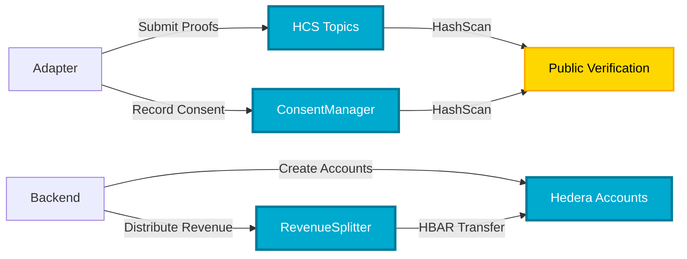
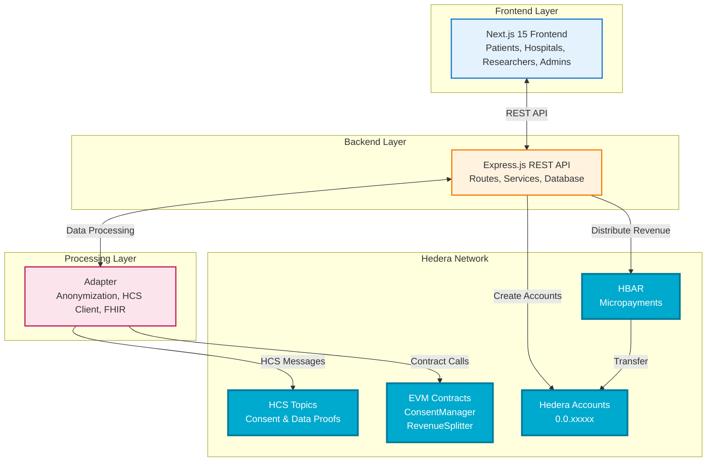
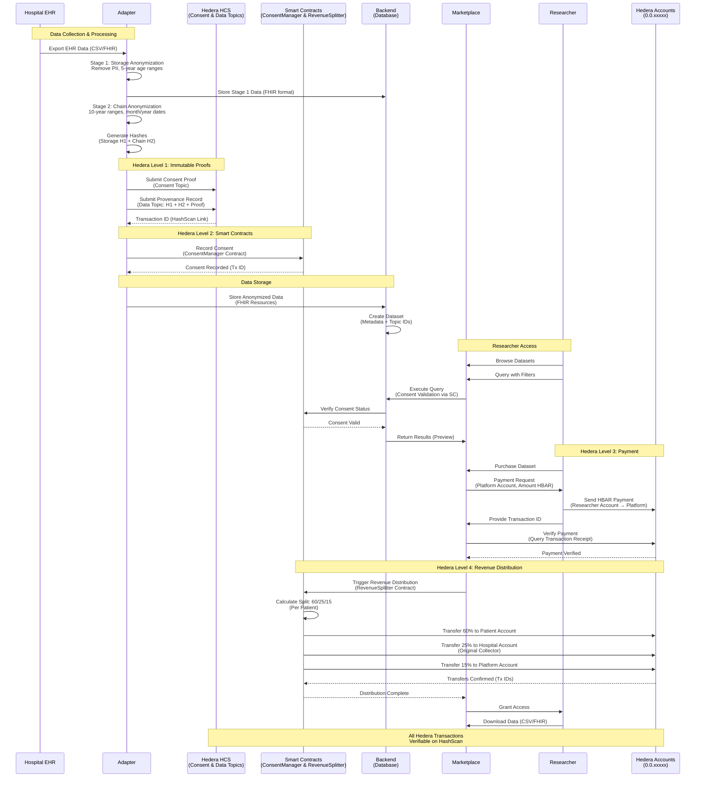
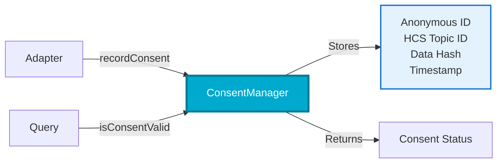
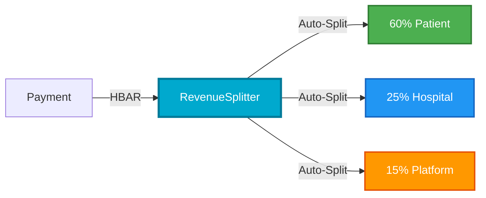
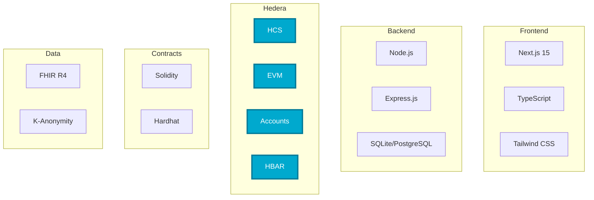

# MediPact - Verifiable Health Data Marketplace

<div align="center">

[](https://hedera.com)
[](LICENSE.md)
[](https://nodejs.org)

**[📚 View Complete Documentation →](./docs)** | **[🌐 Live Docs (Frontend) →](http://localhost:3000/docs)**

</div>

---

## 🎯 What is MediPact?

**MediPact** is a verifiable medical data marketplace that empowers patients to control and monetize their anonymized medical data for research. Built on Hedera Hashgraph, we solve the multi-billion dollar patient data black market problem by creating a transparent, ethical platform using the Hedera Consensus Service for immutable proof and HBAR for instant micropayments.

The healthcare ecosystem holds vast amounts of valuable patient data stored across hospitals and clinics, yet much of it remains inaccessible, slowing innovation and research. Even when accessed, patients lack control (consent) and fair compensation for their own health information, while data sharing is limited by privacy and regulatory concerns.

**MediPact** addresses this by providing a secure, ethical, and scalable data marketplace that enables compliant medical data sharing, ensures patient privacy through anonymization and consent management, and supports fair value exchange between data owners and researchers.

---

## 🌐 Hedera Integration

<div align="center">

### **Built on Four Pillars of Hedera**

[](https://hedera.com/consensus-service)
[](https://hedera.com/smart-contracts)
[](https://hedera.com)
[](https://hedera.com)

</div>

### Core Hedera Services

| Service | Usage | Impact |
|---------|-------|--------|
| **HCS** | Immutable storage of consent & data proof hashes | Unchangeable audit trail, ~$0.0001/message |
| **Hedera EVM** | ConsentManager & RevenueSplitter smart contracts | Automated consent registry & revenue distribution |
| **Hedera Account IDs** | Native accounts (0.0.xxxxx) for all users | Seamless UX, direct HBAR transfers |
| **HBAR** | Micropayments for 60/25/15 revenue split | Low-cost, instant settlements |

### Integration Flow


```mermaid
graph LR
    A[Adapter] -->|Submit Proofs| B[HCS Topics]
    A -->|Record Consent| C[ConsentManager]
    D[Backend] -->|Create Accounts| E[Hedera Accounts]
    D -->|Distribute Revenue| F[RevenueSplitter]
    F -->|HBAR Transfer| E
    B -->|HashScan| G[Public Verification]
    C -->|HashScan| G
    
    style B fill:#00A9CE,color:#fff,stroke:#007A99,stroke-width:3px
    style C fill:#00A9CE,color:#fff,stroke:#007A99,stroke-width:3px
    style E fill:#00A9CE,color:#fff,stroke:#007A99,stroke-width:3px
    style F fill:#00A9CE,color:#fff,stroke:#007A99,stroke-width:3px
    style G fill:#FFD700,color:#000,stroke:#FFA500,stroke-width:2px
```

### Hedera Account Creation

- **Hospitals & Researchers:** Accounts are created during registration. The platform generates an ECDSA key pair, creates a Hedera account (0.0.xxxxx) with EVM compatibility, and stores the encrypted private key.
- **Patients:** Accounts are created lazily on first payment. The platform creates the account only when revenue is distributed, reducing upfront costs.
- **Process:** Platform generates keys → creates Hedera account (operator pays ~$0.05) → encrypts private key → stores account ID and EVM address in database. All accounts are EVM-compatible for smart contract interactions.

### Why Hedera?

✅ **HCS is unique** - No other blockchain offers immutable message logging  
✅ **Low fees** - Enables micropayments at scale (~$0.0001 per HCS message)  
✅ **High throughput** - 10,000+ TPS for thousands of daily queries  
✅ **Carbon negative** - Environmentally sustainable  
✅ **Native accounts** - Seamless UX without complex wallet management  
✅ **EVM compatible** - Smart contracts with low gas costs

---

## 🏗️ System Architecture


```mermaid
graph TB
    subgraph "Frontend Layer"
        FE[Next.js 15 Frontend<br/>Patients, Hospitals, Researchers, Admins]
    end
    
    subgraph "Backend Layer"
        API[Express.js REST API<br/>Routes, Services, Database]
    end
    
    subgraph "Processing Layer"
        ADAPTER[Adapter<br/>Anonymization, HCS Client, FHIR]
    end
    
    subgraph "Hedera Network"
        HCS[HCS Topics<br/>Consent & Data Proofs]
        EVM[EVM Contracts<br/>ConsentManager<br/>RevenueSplitter]
        ACCOUNTS[Hedera Accounts<br/>0.0.xxxxx]
        HBAR[HBAR<br/>Micropayments]
    end
    
    FE <-->|REST API| API
    API <-->|Data Processing| ADAPTER
    ADAPTER -->|HCS Messages| HCS
    ADAPTER -->|Contract Calls| EVM
    API -->|Create Accounts| ACCOUNTS
    API -->|Distribute Revenue| HBAR
    HBAR -->|Transfer| ACCOUNTS
    
    style FE fill:#E3F2FD,stroke:#1976D2,stroke-width:2px
    style API fill:#FFF3E0,stroke:#F57C00,stroke-width:2px
    style ADAPTER fill:#FCE4EC,stroke:#C2185B,stroke-width:2px
    style HCS fill:#00A9CE,color:#fff,stroke:#007A99,stroke-width:3px
    style EVM fill:#00A9CE,color:#fff,stroke:#007A99,stroke-width:3px
    style ACCOUNTS fill:#00A9CE,color:#fff,stroke:#007A99,stroke-width:3px
    style HBAR fill:#00A9CE,color:#fff,stroke:#007A99,stroke-width:3px
```

### Components

| Component | Technology | Purpose |
|-----------|-----------|---------|
| **Frontend** | Next.js 15, TypeScript, Tailwind CSS | Patient/Hospital/Researcher/Admin portals |
| **Backend** | Express.js, Node.js, SQLite/PostgreSQL | REST API, patient identity (UPI), marketplace |
| **Adapter** | Node.js, FHIR R4 | Processes EHR data, anonymizes PII, submits to HCS |
| **Smart Contracts** | Solidity (Hedera EVM) | ConsentManager & RevenueSplitter |

---

## 🔄 Data Flow

MediPact uses Hedera at **four distinct levels** throughout the data flow:

1. **Level 1: HCS (Hedera Consensus Service)** - Immutable storage of consent proofs and data provenance
2. **Level 2: Smart Contracts (Hedera EVM)** - Automated consent management and revenue distribution
3. **Level 3: Hedera Accounts** - Native account IDs (0.0.xxxxx) for seamless wallet management
4. **Level 4: HBAR Payments** - Instant, low-cost micropayments for revenue distribution


```mermaid
sequenceDiagram
    participant H as Hospital EHR
    participant A as Adapter
    participant HCS as Hedera HCS<br/>(Consent & Data Topics)
    participant SC as Smart Contracts<br/>(ConsentManager & RevenueSplitter)
    participant B as Backend<br/>(Database)
    participant M as Marketplace
    participant R as Researcher
    participant HA as Hedera Accounts<br/>(0.0.xxxxx)
    
    Note over H,A: Data Collection & Processing
    H->>A: Export EHR Data (CSV/FHIR)
    A->>A: Stage 1: Storage Anonymization<br/>Remove PII, 5-year age ranges
    A->>B: Store Stage 1 Data (FHIR format)
    A->>A: Stage 2: Chain Anonymization<br/>10-year ranges, month/year dates
    A->>A: Generate Hashes<br/>(Storage H1 + Chain H2)
    
    Note over A,HCS: Hedera Level 1: Immutable Proofs
    A->>HCS: Submit Consent Proof<br/>(Consent Topic)
    A->>HCS: Submit Provenance Record<br/>(Data Topic: H1 + H2 + Proof)
    HCS-->>A: Transaction ID (HashScan Link)
    
    Note over A,SC: Hedera Level 2: Smart Contracts
    A->>SC: Record Consent<br/>(ConsentManager Contract)
    SC-->>A: Consent Recorded (Tx ID)
    
    Note over A,B: Data Storage
    A->>B: Store Anonymized Data<br/>(FHIR Resources)
    B->>B: Create Dataset<br/>(Metadata + Topic IDs)
    
    Note over R,M: Researcher Access
    R->>M: Browse Datasets
    R->>M: Query with Filters
    M->>B: Execute Query<br/>(Consent Validation via SC)
    B->>SC: Verify Consent Status
    SC-->>B: Consent Valid
    B->>M: Return Results (Preview)
    
    Note over R,HA: Hedera Level 3: Payment
    R->>M: Purchase Dataset
    M->>R: Payment Request<br/>(Platform Account, Amount HBAR)
    R->>HA: Send HBAR Payment<br/>(Researcher Account → Platform)
    R->>M: Provide Transaction ID
    M->>HA: Verify Payment<br/>(Query Transaction Receipt)
    HA-->>M: Payment Verified
    
    Note over SC,HA: Hedera Level 4: Revenue Distribution
    M->>SC: Trigger Revenue Distribution<br/>(RevenueSplitter Contract)
    SC->>SC: Calculate Split: 60/25/15<br/>(Per Patient)
    SC->>HA: Transfer 60% to Patient Account
    SC->>HA: Transfer 25% to Hospital Account<br/>(Original Collector)
    SC->>HA: Transfer 15% to Platform Account
    HA-->>SC: Transfers Confirmed (Tx IDs)
    SC-->>M: Distribution Complete
    M->>R: Grant Access
    R->>M: Download Data (CSV/FHIR)
    
    Note over HCS,HA: All Hedera Transactions<br/>Verifiable on HashScan
```

---

## 💰 Revenue Distribution

### 60/25/15 Split

Revenue from dataset purchases is automatically distributed:

- **60% → Patient** - Direct compensation for data contribution
- **25% → Hospital** - Original data collector (sole beneficiary)
- **15% → Platform** - MediPact operations and development

### Fair Attribution

**Key Principle**: The hospital that originally collected a patient's data is the sole beneficiary of revenue from that data.

**How It Works**:
1. Total payment is split equally among all patients in the dataset
2. Each patient's share is then split 60/25/15
3. Each patient's 25% goes to their original collecting hospital
4. Multiple hospitals in a dataset each receive revenue only for their own patients

**Example**: Dataset with 100 patients (60 from Hospital A, 40 from Hospital B), payment: 10,000 HBAR
- Amount per patient: 100 HBAR
- Hospital A receives: 60 × 25 HBAR = **1,500 HBAR**
- Hospital B receives: 40 × 25 HBAR = **1,000 HBAR**
- Patients receive: 100 × 60 HBAR = **6,000 HBAR**
- Platform receives: 100 × 15 HBAR = **1,500 HBAR**

**Benefits**: Trustless, Transparent, Instant, Low fees (~$0.0001 per transfer), Fair attribution

See [Revenue Distribution Guide](./docs/REVENUE_DISTRIBUTION_MODEL.md) for complete details.

---

## 🔐 Privacy & Security

### Multi-Layered Security Architecture

MediPact implements **6 layers of security**:

1. **Double Anonymization** - Two-stage process removes all PII and generalizes data
2. **K-Anonymity Enforcement** - Minimum 5 records per demographic group
3. **Patient Consent Control** - Opt-in/opt-out, researcher approvals
4. **Hedera Blockchain Verification** - Immutable consent records and data provenance
5. **Encrypted Storage** - FHIR database with secure access controls
6. **Access Control** - API keys, rate limiting, role-based permissions

### Before vs. After Anonymization

| Before (Raw) | After (Anonymized) |
|--------------|-------------------|
| ❌ Name: "John Doe" | ✅ Anonymous ID: "PID-001" |
| ❌ ID: "P-12345" | ✅ Removed |
| ❌ Address: "123 Main St" | ✅ Country Only: "Uganda" |
| ❌ Phone: "+256-123-4567" | ✅ Removed |
| ❌ DOB: "1990-01-15" | ✅ Age Range: "35-39" |
| ✅ Medical Data | ✅ Medical Data: Preserved |
| ✅ Demographics | ✅ Demographics: Preserved |

### Privacy Guarantees

- ✅ **No PII on Blockchain**: Only anonymous IDs and hashes
- ✅ **No Original Patient IDs**: ConsentManager stores only anonymous IDs
- ✅ **Double Anonymization**: Two-stage process for maximum privacy
- ✅ **K-Anonymity Enforced**: Privacy protection through grouping
- ✅ **Consent Validation**: Database and smart contract level enforcement
- ✅ **Patient Control**: Global opt-in/out, granular preferences
- ✅ **Immutable Audit Trail**: All consent decisions on Hedera HCS

---

## ⚙️ Smart Contracts

### ConsentManager


```mermaid
graph LR
    A[Adapter] -->|recordConsent| B[ConsentManager]
    B -->|Stores| C[Anonymous ID<br/>HCS Topic ID<br/>Data Hash<br/>Timestamp]
    E[Query] -->|isConsentValid| B
    B -->|Returns| F[Consent Status]
    
    style B fill:#00A9CE,color:#fff,stroke:#007A99,stroke-width:3px
    style C fill:#E3F2FD,stroke:#1976D2,stroke-width:2px
```

**Functions**: `recordConsent()`, `revokeConsent()`, `isConsentValid()`, `getConsentByAnonymousId()`

### RevenueSplitter


```mermaid
graph LR
    A[Payment] -->|HBAR| B[RevenueSplitter]
    B -->|Auto-Split| C[60% Patient]
    B -->|Auto-Split| D[25% Hospital]
    B -->|Auto-Split| E[15% Platform]
    
    style B fill:#00A9CE,color:#fff,stroke:#007A99,stroke-width:3px
    style C fill:#4CAF50,color:#fff,stroke:#2E7D32,stroke-width:2px
    style D fill:#2196F3,color:#fff,stroke:#1565C0,stroke-width:2px
    style E fill:#FF9800,color:#fff,stroke:#E65100,stroke-width:2px
```

**Functions**: `receive()` (auto-distribute), `distributeRevenueTo()`, `getSplitPercentages()`

---

## 🚀 Quick Start

### Prerequisites

- **Node.js 18+** - [Download](https://nodejs.org/)
- **Hedera Testnet Account** - [Get Free Account](https://portal.hedera.com/dashboard)
- **Git**

### Setup

```bash
# 1. Clone & install 
git clone https://github.com/najuna-brian/medipact.git && cd medipact
cd adapter && npm install
cd ../backend && npm install  
cd ../frontend && npm install
cd ../contracts && npm install
```

```bash
# 2. Configure .env files (see Environment Variables section)
# 3. Start services
cd backend && npm start      # Port 8080
cd frontend && npm run dev   # Port 3000
cd adapter && npm start      # Process data
```

### MVP Configuration

For MVP/demo deployment, see [MVP Configuration Guide](./docs/MVP_CONFIGURATION.md) which covers:
- Manual withdrawal processing
- Testnet Hedera accounts
- In-app notifications (no email/SMS)
- Basic authentication setup

---

## 🔧 Environment Variables

### Frontend (`frontend/.env.local`)

```env
NEXT_PUBLIC_API_URL="http://localhost:8080"
NEXT_PUBLIC_BACKEND_API_URL="http://localhost:8080"
NEXT_PUBLIC_HEDERA_NETWORK="testnet"
```

### Backend (`backend/.env`)

```env
PORT=8080
HEDERA_NETWORK=testnet
OPERATOR_ID=0.0.xxxxx
OPERATOR_KEY=your_private_key
PLATFORM_HEDERA_ACCOUNT_ID=0.0.xxxxx
```

### Adapter (`backend/adapter/.env`)

```env
HEDERA_NETWORK=testnet
OPERATOR_ID=0.0.xxxxx
OPERATOR_KEY=your_private_key
```

See `env.example` for complete configuration options.

---

## 📡 Documentation

### Interactive Documentation

- **🌐 Frontend Documentation**: [http://localhost:3000/docs](http://localhost:3000/docs) - Complete interactive documentation with diagrams
- **📋 API Swagger UI**: [http://localhost:8080/api-docs](http://localhost:8080/api-docs) - Interactive API reference

### Key Documentation Pages

- [Overview](/docs) - Main documentation hub
- [Quick Start](/docs/quick-start) - Getting started guide
- [Data Flow](/docs/data-flow) - Complete data flow with Hedera integration
- [Revenue Distribution](/docs/revenue-distribution) - Revenue model details
- [Hedera Integration](/docs/hedera) - Hedera services usage
- [Privacy & Security](/docs/privacy) - Security architecture
- [Smart Contracts](/docs/smart-contracts) - Contract documentation
- [API Reference](/docs/api) - Full API reference

### Markdown Documentation

- [Revenue Distribution Model](./docs/REVENUE_DISTRIBUTION_MODEL.md) - Detailed revenue model
- [Payment & Withdrawal System](./docs/PAYMENT_AND_WITHDRAWAL_SYSTEM.md) - Payment system details
- [System Integration Status](./docs/SYSTEM_INTEGRATION_STATUS.md) - Integration verification
- [Testing Guide](./TESTING_GUIDE.md) - Testing documentation

---

## ✨ Key Features

| Feature | Description |
|--------|-------------|
| **FHIR R4 Compliant** | Interoperable with global medical record systems |
| **K-Anonymity Enforcement** | Privacy by design (minimum 5 records per group) |
| **HCS Immutable Proof Storage** | Unchangeable audit trail on Hedera Consensus Service |
| **Double Anonymization** | Two-stage anonymization with provenance tracking on Hedera |
| **Multi-Layered Security** | 6-layer security architecture |
| **Patient Identity System (UPI)** | Cross-hospital identity linking |
| **Automatic Wallet Creation** | Hedera accounts created automatically, users never manage private keys |
| **Automated HBAR Revenue Distribution** | 60/25/15 split managed by smart contract |
| **Fair Revenue Model** | Original collecting hospital is sole beneficiary of their data |
| **Category-Based Pricing** | 6 pricing tiers, 40% of market rates, volume discounts |
| **Multi-Dimensional Query Engine** | Filter by country, date, condition, demographics, all 10 FHIR domains |
| **Patient-Centric Data Control** | Global opt-in/out, researcher approvals, granular preferences |
| **HashScan Verification** | Publicly verifiable transactions on HashScan |

---

## 🧪 Testing

### Demo Data Population

For MVP presentations and demos, populate the database with comprehensive test data:

```bash
# Populate with demo data (hospitals, researchers, patients, FHIR data)
cd backend
npm run populate-demo

# Custom configuration
PATIENTS_PER_HOSPITAL=500 NUM_HOSPITALS=5 npm run populate-demo

# For hosted environments
API_URL=https://your-api.com npm run populate-demo
```

This creates:
- Multiple verified hospitals with API keys
- Multiple verified researchers
- Hundreds/thousands of patients with realistic medical data
- Multiple datasets ready for purchase
- All login credentials saved to `backend/demo-credentials.json`

See `backend/scripts/DEMO_DATA_README.md` for details.

### Test Scripts

```bash
# Test complete data flow (upload → processing → researcher access)
node scripts/test-complete-data-flow.js

# Test revenue flow (USD → HBAR → distribution → wallets)
node scripts/test-revenue-flow.js

# Verify system integration (frontend ↔ backend)
node scripts/verify-system-integration.js
```

### Unit & Integration Tests

```bash
# Run adapter tests
cd backend/adapter && npm test

# Run backend tests
cd backend && npm test

# Run contract tests
cd contracts && npm test
```

### Documentation

- [Data Flow Test Guide](./scripts/DATA_FLOW_TEST_README.md)
- [Revenue Flow Test Guide](./scripts/REVENUE_FLOW_TEST_README.md)
- [System Integration Status](./docs/SYSTEM_INTEGRATION_STATUS.md)

---

## 🛠️ Technology Stack


```mermaid
graph TB
    subgraph "Frontend"
        F1[Next.js 15]
        F2[TypeScript]
        F3[Tailwind CSS]
    end
    
    subgraph "Backend"
        B1[Node.js]
        B2[Express.js]
        B3[SQLite/PostgreSQL]
    end
    
    subgraph "Hedera"
        H1[HCS]
        H2[EVM]
        H3[Accounts]
        H4[HBAR]
    end
    
    subgraph "Contracts"
        C1[Solidity]
        C2[Hardhat]
    end
    
    subgraph "Data"
        D1[FHIR R4]
        D2[K-Anonymity]
    end
    
    style H1 fill:#00A9CE,color:#fff,stroke:#007A99,stroke-width:3px
    style H2 fill:#00A9CE,color:#fff,stroke:#007A99,stroke-width:3px
    style H3 fill:#00A9CE,color:#fff,stroke:#007A99,stroke-width:3px
    style H4 fill:#00A9CE,color:#fff,stroke:#007A99,stroke-width:3px
```

---

## 🤝 Contributing

See [CONTRIBUTING.md](./CONTRIBUTING.md) for development workflow and guidelines.

---

## 📄 License

[To be determined - Apache 2.0 or MIT]

---

<div align="center">

## Hackathon Information
### Hedera Hello Future: Ascension 2025  
### Open Track - Verifiable Healthcare Systems  
### Team Medipact

[](https://hedera.com)

[GitHub](https://github.com/najuna-brian/medipact) • [Issues](https://github.com/najuna-brian/medipact/issues)

</div>
