# MediPact - Verifiable Health Data Marketplace

<div align="center">

[](https://hedera.com)
[](LICENSE)
[](https://nodejs.org)

</div>

---

## 🎯 What Medipact is

**MediPact** is a verifiable medical data marketplace that empowers patients to control and monetize their anonymized medical data for research. Built on Hedera Hashgraph, we solve the multi-billion dollar patient data black market problem by creating a transparent, ethical platform using the Hedera Consensus Service for immutable proof and HBAR for instant micropayments.

The **healthcare ecosystem** holds vast amounts of valuable patient data stored across hospitals and clinics, yet much of it remains **inaccessible** which slows innovation and research. Even when accessed, Patients **lack control(consent) and fair compensation** for their own health information, while data sharing is limited by privacy and regulatory concerns.

**MediPact** addresses this by providing a **secure, ethical, and scalable data marketplace** that enables compliant medical data sharing, ensures patient privacy through anonymization and consent management, and supports fair value exchange between data owners and researchers.

---

## 🌐 Hedera Integration

<div align="center">

### **Built on Four Pillars of Hedera**

[](https://hedera.com/consensus-service)
[](https://hedera.com/smart-contracts)
[](https://hedera.com)
[](https://hedera.com)

</div>

### Core Hedera Services

| Service | Usage | Impact |
|---------|-------|--------|
| **HCS** | Immutable storage of consent & data proof hashes | Unchangeable audit trail, ~$0.0001/message |
| **Hedera EVM** | ConsentManager & RevenueSplitter smart contracts | Automated consent registry & revenue distribution |
| **Hedera Account IDs** | Native accounts (0.0.xxxxx) for all users | Seamless UX, direct HBAR transfers |
| **HBAR** | Micropayments for 60/25/15 revenue split | Low-cost, instant settlements |

### Integration Flow


**Hedera Account Creation**:

**Hospitals & Researchers:** Accounts are created during registration. The platform generates an ECDSA key pair, creates a Hedera account (0.0.xxxxx) with EVM compatibility, and stores the encrypted private key.

**Patients:** Accounts are created lazily on first payment. The platform creates the account only when revenue is distributed, reducing upfront costs.

**Process:** Platform generates keys → creates Hedera account (operator pays ~$0.05) → encrypts private key → stores account ID and EVM address in database. All accounts are EVM-compatible for smart contract interactions.

### Why Hedera?

✅ **HCS is unique** - No other blockchain offers immutable message logging  
✅ **Low fees** - Enables micropayments at scale (~$0.0001 per HCS message)  
✅ **High throughput** - 10,000+ TPS for thousands of daily queries  
✅ **Carbon negative** - Environmentally sustainable  
✅ **Native accounts** - Seamless UX without complex wallet management  
✅ **EVM compatible** - Smart contracts with low gas costs

---

## 🏗️ System Architecture


### Components

| Component | Technology | Purpose |
|-----------|-----------|---------|
| **Frontend** | Next.js 15, TypeScript, Tailwind CSS | Patient/Hospital/Researcher/Admin portals |
| **Backend** | Express.js, Node.js, SQLite/PostgreSQL | REST API, patient identity (UPI), marketplace |
| **Adapter** | Node.js, FHIR R4 | Processes EHR data, anonymizes PII, submits to HCS |
| **Smart Contracts** | Solidity (Hedera EVM) | ConsentManager & RevenueSplitter |

---

## 🔄 Data Flow


### Processing Pipeline

```mermaid
flowchart LR
    A[Raw EHR Data] --> B[Parse & Validate]
    B --> C[Anonymize PII]
    C --> D[Preserve Demographics]
    D --> E[Generate Anonymous IDs]
    E --> F[Enforce K-Anonymity]
    F --> G[Generate Hashes]
    G --> H[Submit to HCS]
    H --> I[Record on Contract]
    I --> J[Store in Backend]
    J --> K[Marketplace Ready]
    
    style A fill:#FFCDD2,stroke:#D32F2F,stroke-width:2px
    style C fill:#FFF9C4,stroke:#F57F17,stroke-width:2px
    style D fill:#C8E6C9,stroke:#388E3C,stroke-width:2px
    style H fill:#00A9CE,color:#fff,stroke:#007A99,stroke-width:3px
    style I fill:#00A9CE,color:#fff,stroke:#007A99,stroke-width:3px
    style K fill:#BBDEFB,stroke:#1976D2,stroke-width:2px
```



---

**How It Works**:
1. Researcher purchases dataset (pays in HBAR)
2. RevenueSplitter contract receives payment
3. **Automatically distributes**: 60% Patient, 25% Hospital, 15% Platform
4. All transactions verifiable on HashScan

**Benefits**: Trustless, Transparent, Instant, Low fees

---

## 🔐 Privacy & Anonymization

### Before vs. After

| Before (Raw) | After (Anonymized) |
|--------------|-------------------|
| ❌ Name: "John Doe" | ✅ Anonymous ID: "PID-001" |
| ❌ ID: "P-12345" | ✅ Removed |
| ❌ Address: "123 Main St" | ✅ Country Only: "Uganda" |
| ❌ Phone: "+256-123-4567" | ✅ Removed |
| ❌ DOB: "1990-01-15" | ✅ Age Range: "35-39" |
| ✅ Medical Data | ✅ Medical Data: Preserved |
| ✅ Demographics | ✅ Demographics: Preserved |

### K-Anonymity Protection

- **Minimum 5 records** per demographic group
- Groups: Country, Age Range, Gender, Occupation
- Records with <5 are **suppressed**

### Privacy Guarantees

- ✅ **No PII on Blockchain**: Only anonymous IDs and hashes
- ✅ **No Original Patient IDs**: ConsentManager stores only anonymous IDs
- ✅ **Demographics Generalized**: Prevents re-identification
- ✅ **K-Anonymity Enforced**: Privacy protection through grouping
- ✅ **Consent Validation**: Database-level enforcement

---

## ⚙️ Smart Contracts

### ConsentManager


**Functions**: `recordConsent()`, `revokeConsent()`, `isConsentValid()`, `getConsentByAnonymousId()`

### RevenueSplitter


**Functions**: `receive()` (auto-distribute), `distributeRevenueTo()`, `getSplitPercentages()`

---

## 🚀 Quick Start

### Prerequisites

- **Node.js 18+** - [Download](https://nodejs.org/)
- **Hedera Testnet Account** - [Get Free Account](https://portal.hedera.com/dashboard)
- **Git**

### Setup

```bash
# 1. Clone & install 
git clone git@github.com:najuna-brian/medipact.git && cd medipact
cd adapter && npm install
```
```bash
# install backend
cd ../backend && npm install  
```
```bash
# Install frontend
cd ../frontend && npm install
```
```bash
# Install conracts
cd ../contracts && npm install
```
```bash
# 2. Configure .env files (see Environment Variables section)
# 3. Start services
cd backend && npm start      # Port 3002
```
```bash
cd frontend && npm run dev   # Port 3000
```
```bash
cd adapter && npm start      # Process data
```
---

## 🔧 Environment Variables

### Check the environment variables in (`../.env`) of `../backend` `../frontend` `../adapter`

### Frontend (`frontend/.env.local`)

```env
NEXT_PUBLIC_API_URL="http://localhost:3002"
NEXT_PUBLIC_HEDERA_NETWORK="testnet"
```

---

## 📡 API Documentation

**Interactive Swagger UI**: http://localhost:3002/api-docs

---

## 🗄️ Database Schema


---

## 🛠️ Technology Stack


## ✨ Key Features

| Feature | Description |
|--------|-------------|
| **FHIR R4 Compliant** | Interoperable with global medical record systems |
| **K-Anonymity Enforcement** | Privacy by design (minimum 5 records per group) |
| **HCS Immutable Proof Storage** | Unchangeable audit trail on Hedera Consensus Service |
| **Secure Data Vault** | Encrypted storage with patient-controlled access |
| **Automated HBAR Revenue Distribution** | 60/25/15 split managed by smart contract |
| **Patient Identity System (UPI)** | Cross-hospital identity linking |
| **Consent Validation** | Enforced at the database and smart-contract levels |
| **Multi-Dimensional Query Engine** | Filter by country, date, condition, demographics |
| **Smart Contract Integration** | On-chain consent registry and revenue sharing |
| **Role-Based Dashboards** | Patient, Hospital, Researcher, and Admin portals |
| **HashScan Verification** | Publicly verifiable transactions on HashScan |

---

## 🧪 Development

```bash
# Run tests
cd contracts && npm test
cd adapter && npm run validate
```
```bash
# Development mode
cd backend && npm run dev
cd frontend && npm run dev
```
```bash
# Deploy contracts
cd contracts && npm run deploy:testnet
```

---

**External Links**:
- [Hedera Portal](https://portal.hedera.com/) - Get testnet account
- [HashScan Explorer](https://hashscan.io/) - View transactions
- [FHIR R4 Specification](https://www.hl7.org/fhir/) - Healthcare data standard
- [A Comprehensive Guide to Healthcare Data Security](https://www.metomic.io/resource-centre/a-comprehensive-guide-to-healthcare-data-security#:~:text=By%20prioritising%20data%20security%2C%20healthcare,availability%20of%20sensitive%20healthcare%20information.) - How to meet the healthcare data security standards
- [Why is Healthcare Data so Valuable?](https://blog.tbconsulting.com/why-healthcare-data-is-so-valuable-on-the-black-market#:~:text=Sensitive%20information%20from%20medical%20data,cybercriminals%20at%20an%20alarming%20rate.) -
- [Establishing a Health Data Marketplace: A Framework for Success](https://www.researchgate.net/publication/376532396_Establishing_a_Health_Data_Marketplace_A_Framework_for_Success#:~:text=Abstract,outcomes%2C%20research%2C%20and%20innovation.)


---

## 🤝 Contributing

See [CONTRIBUTING.md](./CONTRIBUTING.md) for development workflow and guidelines.

---

## 📄 License

[To be determined - Apache 2.0 or MIT]

---
<div align="center">
## Hackathon Information

### Hedera Hello Future: Ascension 2025  
### Open Track - Verifiable Healthcare Systems  
### Team Medipact
</div>
---

<div align="center">

[](https://hedera.com)

[GitHub](https://github.com/najuna-brian/medipact) • [Issues](https://github.com/najuna-brian/medipact/issues) 

</div>
